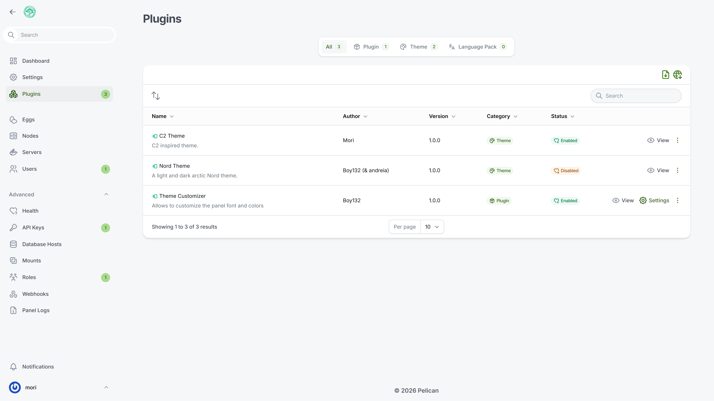
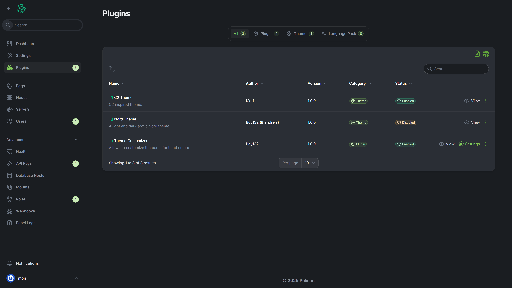

# C2 Theme (By [Mori](https://github.com/MoriitoDev))

A light and dark theme, based on C.C.

_Originally created by [Andréia Bohner](https://github.com/andreia) as [Filament Theme](https://github.com/andreia/filament-nord-theme), under MIT License._

## Preview

## License

This theme is licensed under the GNU General Public License v3.0.
Based on the original work by Andréia Bohner, which was under the MIT License.

_Thanks to [Boy123](https://github.com/Boy132) for the theme inspiration._